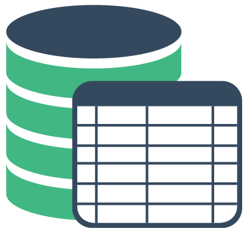

<p align="center">
    <a href="https://github.com/coderdiaz/vue-datasource">
        
    </a>
    <h2 align="center">Vue Datasource</h2>
</p>

<p align="center">
    A Vue.js server side component to create dynamic tables. Compatible with Vue 2.x and Laravel.
</p>

<p align="center">
    <a href="https://github.com/coderdiaz/vue-datasource/blob/master/LICENSE"></a>
    <a href="https://github.com/coderdiaz/vue-datasource/stargazers"></a>
    <a href="http://npmjs.com/package/vue-datasource"></a>
    <a href="http://npmjs.com/package/vue-datasource"></a>
</p>

---

### Demo

[](http://forthebadge.com)
[](http://forthebadge.com)


Live: https://young-falls-97690.herokuapp.com/


### Install/Usage
```
$ npm install vue-datasource
```

```html
<div id="#app">
    <datasource
        language="en"
        :table-data="information.data"
        :columns="columns"
        :pagination="information.pagination"
        :actions="actions"
        v-on:change="changePage"
        v-on:searching="onSearch"></datasource>
</div>
```

```javascript
import Datasource from 'vue-datasource'

new Vue({
    el: '#app',
    components: {
        Datasource
    },
    data() {
        return {
            information: {
                pagination: {...},
                data: [...]
            },
            columns: [...],
            actions: [...]
        }
    },
    methods: {
        changePage(values) {...},
        onSearch(searchQuery) {...}
    }
});
```

### Available Props
| Prop        | Type    | Default | Description                                                 |
|-------------|---------|---------|-------------------------------------------------------------|
| table-data  | Array   |         | Table information                                           |
| language    | String  | es      | Defines the table labels language                           |
| columns     | Array   |         | Columns to display                                          |
| pagination  | Object  |         | Pagination information about the table data ([structure] (#pagination-structure))   |
| actions     | Array   |         | Action buttons ([structure] (#action-event-sctructure))                   |

### Available Events
| Event       | Description                                                                                         |
|-------------|-----------------------------------------------------------------------------------------------------|
| change      | Handle show limit changed. Gets object with new show limit and current page `{perpage: 10, page: 2}`|
| searching   | Handles search input. Gets string as parameter                                                      |

### Available Languages
| Language    | Abbr  |
|-------------|-------|
| Spanish     | es    |
| English     | en    |
| French      | fr    |
| Chinese (Simplified)     | zh-CN |
| Catalan     | ca |

### Columns
Each column object needs a `name` and `key` attributes.
```javascript
{
    ...,
    columns: [
        {
            name: 'Name', // Table column name to display
            key: 'name', // Key name from row object
        }
    ]
}
```

For Laravel users, you can access relationships through the `key` attribute. Lets say we have the following object in our users array.

```javascript
[
    ...,
    {
        name: 'Foo',
        last_name: 'Bar'
        role_id: 1,
        role: {
            name: 'admin'
        }
    }
]
```

To get the user's role we would need to define in our columns array:
```javascript
{
    ...,
    columns: [
        {
            name: 'Role',
            key: 'role.name'
        }
    ]
}
```


### Render column
This callback will modify the data for various operations. Such as applying a specific format or an arithmetic operation to the column value and return it.
```javascript
{
    ...,
    columns: [
        {
            name: 'Name',
            key: 'name',
            render(value) { // Render callback
                return `Enginner ${value}`;
            }
        }
    ]
}
```

### Pagination Structure
```javascript
{
    ...,
    pagination: {
        total: 25, // Number of total rows (default 0)
        per_page: 15, // Number of rows to show (default 15)
        current_page: 1, // Actual page
        last_page: 2, // Last page
        from: 1, // Beginning of visible rows
        to: 15 // End of visible rows
    }
}
```

### Action Event Sctructure
```javascript
{
    ...,
    actions: [
        {
            text: 'Click me', // Button label
            icon: 'glyphicon glyphicon-check', // Button icon
            class: 'btn-primary', // Button class (background color)
            event(e, row) { // Event handler callback. Gets event instace and selected row
                console.log('Click row: ', row); // If no row is selected, row will be NULL
            }
        }
    ]
}
```

### Implementation examples
- Using Laravel 5.3 and pagination: [laravel-datasource-example](https://github.com/coderdiaz/laravel-datasource-example).


### Contributions
All contributions are welcome send your PR and Issues.

### License
Vue Datasource is open-sourced software licensed under the [MIT license](https://raw.githubusercontent.com/coderdiaz/vue-datasource/master/LICENSE)

##### Created by Javier Diaz. Translation enhancement by [itsuwaribito] (https://github.com/itsuwaribito)
